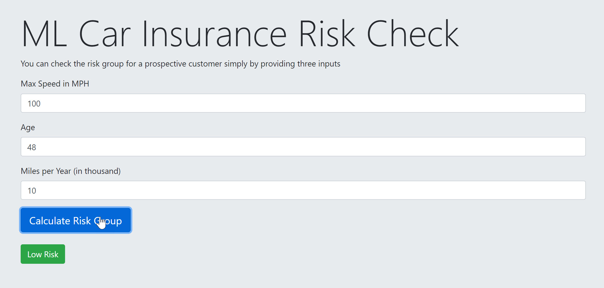

# Companion notebooks for the code samples of the video course "Deep Learning Crash Course"

This repository contains notebooks implementing the code samples found in the video course [Deep Learning Crash Course (Manning Publications)](https://www.manning.com/livevideo/deep-learning-crash-course?a_aid=djcordhose&a_bid=e8e77cbf). Note that the video course features far more content than you will find in these notebooks, in particular further explanations and figures. Here we have only included the code samples themselves and immediately related surrounding comments.

## Our Crash Risk Calculator running on TensorFlow.js

In this course we train a model that can predict the crash risk of a driver based on three simple inputs.
We train the model using Colab notebooks on Google's GPU based hardware and convert the final model to a format
<a href='https://www.tensorflow.org/js/' target='_blank'>TensorFlow.js</a> supports. This allows us to deploy the
model togther with a simple application that runs serverless in the browser. 

Try is out here (you will need an up to version of a modern browser to do this):

https://djcordhose.github.io/deep-learning-crash-course-notebooks/

## Original Notebooks

These notebooks have been created using Python 3.6 and TensorFlow 1.11

* Unit 3:
    * [Notebook 3.3: Getting to know our data](https://colab.research.google.com/github/djcordhose/deep-learning-crash-course-notebooks/blob/master/U3-M3-data.ipynb)
    * [Notebook 3.5: Introduction to Neural Networks with TensorFlow and Keras Layers](https://colab.research.google.com/github/djcordhose/deep-learning-crash-course-notebooks/blob/master/U3-M5-nn-intro.ipynb)
    * [Notebook 3.7: Training Neural Networks with TensorFlow and Keras Layers](https://colab.research.google.com/github/djcordhose/deep-learning-crash-course-notebooks/blob/master/U3-M7-nn-training.ipynb)
    * [Exercise 3.7: Draw Decision Boundaries by hand](https://raw.githubusercontent.com/DJCordhose/deep-learning-crash-course-notebooks/master/exercise/manual-decision-boundaries.pdf)
    * [Notebook 3.9: Regularization - How to get a decent architecture?](https://colab.research.google.com/github/djcordhose/deep-learning-crash-course-notebooks/blob/master/U3-M9-regularization.ipynb)
    * [Notebook 3.10: Our Final TensorFlow Model](https://colab.research.google.com/github/djcordhose/deep-learning-crash-course-notebooks/blob/master/U3-M10-final-model.ipynb)
    
* Unit 4:
  * [Notebook 4.2: Converting our Keras model for tensorflow.js](https://colab.research.google.com/github/djcordhose/deep-learning-crash-course-notebooks/blob/master/U4-M2-tensorflowjs.ipynb)
  * [Notebook 4.4: Preparing our Keras model for serving](https://colab.research.google.com/github/djcordhose/deep-learning-crash-course-notebooks/blob/master/U4-M4-tf-prep.ipynb)
  * [Notebook 4.5: Checking our TensorFlow model](https://colab.research.google.com/github/djcordhose/deep-learning-crash-course-notebooks/blob/master/U4-M5-tf-check.ipynb)
  * [Notebook 4.6: Hosting your model on Google Cloud ML](https://colab.research.google.com/github/djcordhose/deep-learning-crash-course-notebooks/blob/master/U4-M6-cloud.ipynb)
  * [Notebook 4.7: Running on a dedicated Linux server](https://colab.research.google.com/github/djcordhose/deep-learning-crash-course-notebooks/blob/master/U4-M7-local.ipynb)

## TensorFlow 2

TensorFlow models from Unit 3 converted to TensorFlow 2

_Caution: TensorFlow 2.0 is still not final, yet._

* Reference
    * https://www.tensorflow.org/alpha/guide/effective_tf2
    * https://www.tensorflow.org/alpha/guide/eager
    * https://www.tensorflow.org/alpha/guide/keras/
    * https://www.tensorflow.org/versions/r2.0/api_docs/python/tf

* Unit 3 converted to TensorFlow 2:
    * [Notebook 3.5 / TF 2: Introduction to Neural Networks with TensorFlow and Keras Layers](https://colab.research.google.com/github/djcordhose/deep-learning-crash-course-notebooks/blob/master/tf-v2/U3-M5-nn-intro.ipynb)
    * [Notebook 3.7 / TF 2: Training Neural Networks with TensorFlow and Keras Layers](https://colab.research.google.com/github/djcordhose/deep-learning-crash-course-notebooks/blob/master/tf-v2/U3-M7-nn-training.ipynb)
    * [Notebook 3.9 / TF 2: Regularization - How to get a decent architecture?](https://colab.research.google.com/github/djcordhose/deep-learning-crash-course-notebooks/blob/master/tf-v2/U3-M9-regularization.ipynb)
    * [Notebook 3.10 / TF 2: Our Final TensorFlow Model](https://colab.research.google.com/github/djcordhose/deep-learning-crash-course-notebooks/blob/master/tf-v2/U3-M10-final-model.ipynb)

